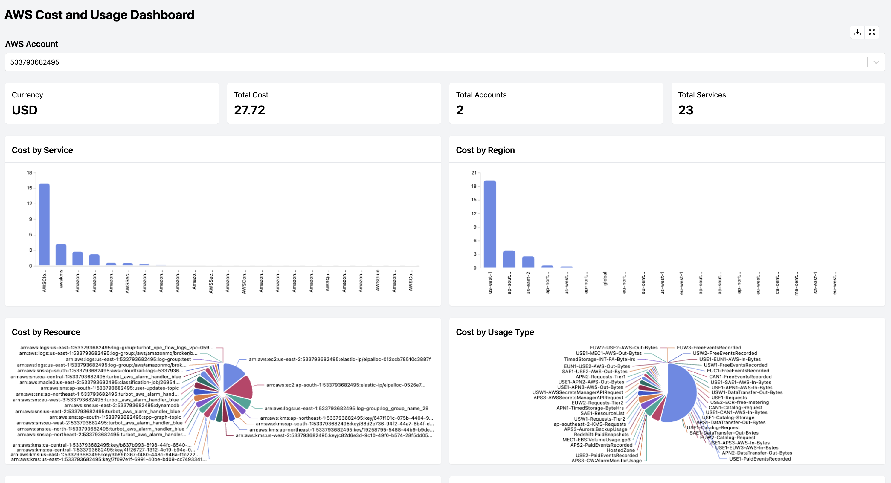

# AWS Cost and Usage Report Thrifty Mod for Powerpipe

[Tailpipe](https://tailpipe.io) is an open-source CLI tool that allows you to collect logs and query them with SQL.

[AWS](https://aws.amazon.com/) provides on-demand cloud computing platforms and APIs to authenticated customers on a metered pay-as-you-go basis.

The [AWS Cost and Usage Report Thrifty Mod](https://hub.powerpipe.io/mods/turbot/tailpipe-mod-aws-cost-usage-report-thrifty) contains pre-built dashboards which can be used to monitor and analyze costs across your AWS accounts.

View insights in dashboards:


## Documentation

- **[Dashboards →](https://hub.powerpipe.io/mods/turbot/tailpipe-mod-aws-cost-usage-report-thrifty/dashboards)**

## Getting Started

Install Powerpipe from the [downloads](https://powerpipe.io/downloads) page:

```sh
# MacOS
brew install turbot/tap/powerpipe
```

```sh
# Linux or Windows (WSL)
sudo /bin/sh -c "$(curl -fsSL https://powerpipe.io/install/powerpipe.sh)"
```

This mod requires AWS Cost and Usage Reports to be collected using [Tailpipe](https://tailpipe.io) with the [AWS plugin](https://hub.tailpipe.io/plugins/turbot/aws):

- [Get started with the AWS plugin for Tailpipe →](https://hub.tailpipe.io/plugins/turbot/aws#getting-started)

Install the mod:

```sh
mkdir dashboards
cd dashboards
powerpipe mod install github.com/turbot/tailpipe-mod-aws-cost-usage-report-thrifty
```

### Browsing Dashboards

Start the dashboard server:

```sh
powerpipe server
```

Browse and view your dashboards at **http://localhost:9033**.

The dashboard provides insights into:

- Total costs across AWS accounts
- Cost distribution by services, regions, and resources
- Cost anomaly detection
- Daily and monthly cost trends
- Usage type analysis
- Top high-cost services

## Open Source & Contributing

This repository is published under the [Apache 2.0 license](https://www.apache.org/licenses/LICENSE-2.0). Please see our [code of conduct](https://github.com/turbot/.github/blob/main/CODE_OF_CONDUCT.md). We look forward to collaborating with you!

[Tailpipe](https://tailpipe.io) and [Powerpipe](https://powerpipe.io) are products produced from this open source software, exclusively by [Turbot HQ, Inc](https://turbot.com). They are distributed under our commercial terms. Others are allowed to make their own distribution of the software, but cannot use any of the Turbot trademarks, cloud services, etc. You can learn more in our [Open Source FAQ](https://turbot.com/open-source).

## Get Involved

**[Join #tailpipe and #powerpipe on Slack →](https://turbot.com/community/join)**

Want to help but don't know where to start? Pick up one of the `help wanted` issues:

- [Powerpipe](https://github.com/turbot/powerpipe/labels/help%20wanted)
- [Tailpipe](https://github.com/turbot/tailpipe/labels/help%20wanted)
- [AWS Cost and Usage Report Thrifty Mod](https://github.com/turbot/tailpipe-mod-aws-cost-usage-report-thrifty/labels/help%20wanted)
